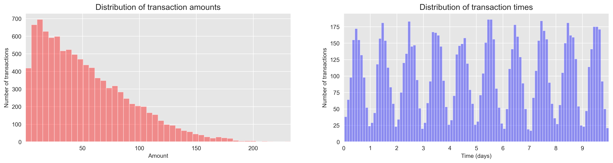
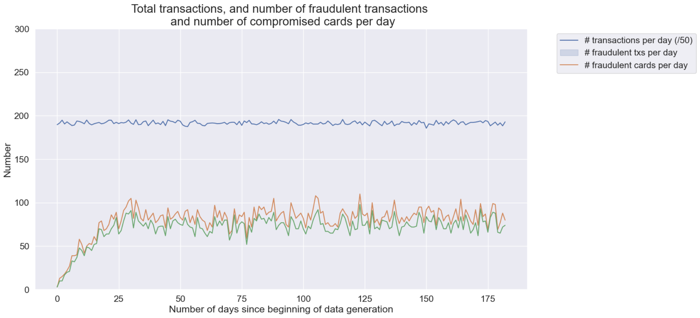
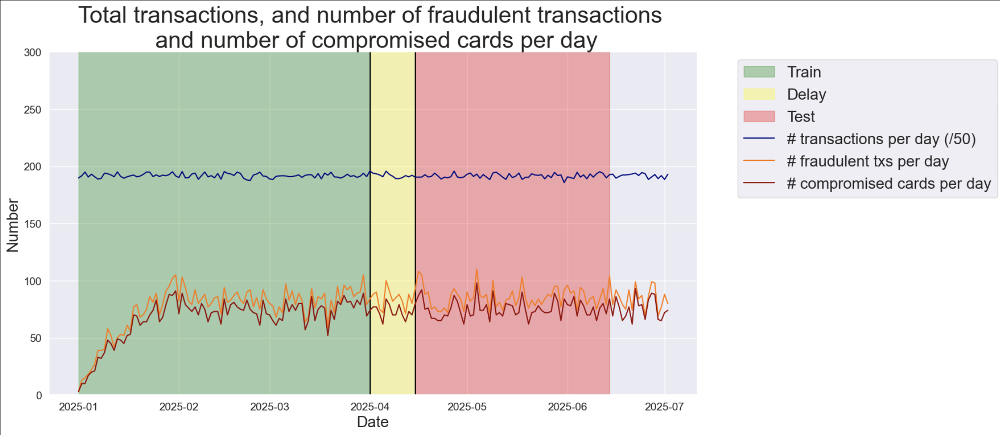

# Credit Card Fraud Detection with Machine Learning

This project implements and evaluates machine learning models for detecting fraudulent credit card transactions using a synthetic transaction simulator. It compares several classification models and introduces an operational card-level evaluation metric, **Card Precision@k**, designed to reflect the daily capacity of fraud analysts.

## Project Overview

Fraud detection is challenging because fraudulent transactions are rare, fraud patterns change over time, and models must often support fast operational decisions. This project addresses these challenges by building a full machine learning workflow for simulated credit card transaction data.

The workflow includes:

- Synthetic customer and terminal profile generation
- Transaction simulation with realistic temporal and spatial patterns
- Fraud injection scenarios
- Feature engineering for transaction behaviour and terminal risk
- Chronological train-delay-test splitting
- Model training and evaluation
- Comparison of statistical and operational metrics

## Models Evaluated

The following models are implemented and compared:

- Logistic Regression
- Decision Tree with restricted depth
- Decision Tree with unrestricted depth
- Random Forest
- Gradient Boosting

## Evaluation Metrics

The models are evaluated using both standard and operational metrics:

- AUC ROC
- Average Precision
- Card Precision@k
- Training time
- Prediction time

**Card Precision@k** measures how many of the top `k` flagged cardholders are truly compromised, making it useful for real-world fraud investigation workflows where analysts can only inspect a limited number of cases per day.


## Visual Analysis

### 1. Transaction Amount Distribution



Transaction amounts are highly right-skewed: most transactions are small or medium-sized, while a small number are very large. This is typical for financial transaction data and motivates feature scaling or transformations for modeling.

---

### 2. Fraudulent Transactions Over Time



The total number of transactions per day remains relatively stable, while fraudulent transactions and compromised cards fluctuate daily.  

- Highlights the **class imbalance problem** (frauds are rare).  
- Shows the need for **specialized metrics** like Average Precision or Card Precision@100 for evaluation.

---

### 3. Chronological Train / Delay / Test Split



The dataset is split **chronologically** into training, delay, and test periods to simulate real-world scenarios:  

- The **delay period** models fraud confirmation lag.  
- Prevents **future information leakage**, ensuring realistic model evaluation.

---

## Key Results

Based on the project report, all models performed significantly better than random guessing. Test-set AUC ROC scores ranged from approximately **0.846 to 0.899**, and Average Precision ranged from approximately **0.506 to 0.777**.

Random Forest achieved the best Average Precision, while Logistic Regression provided a strong balance between performance and computational efficiency.

| Model                   | AUC ROC | Average Precision | Card Precision@100 |
|-------------------------|---------|-----------------|------------------|
| Logistic Regression     | 0.899   | 0.739           | 0.110            |
| Decision Tree Depth 2   | 0.846   | 0.619           | 0.100            |
| Decision Tree Unlimited | 0.863   | 0.506           | 0.101            |
| Random Forest           | 0.897   | 0.777           | 0.110            |
| Gradient Boosting       | 0.866   | 0.736           | 0.107            |

---

## Repository Structure

```text
credit-card-fraud-detection/
│
├── notebooks/
│   └── fraud_detection_pipeline.ipynb
├── assets/
│   ├── transaction_distributions.png
│   ├── fraud_activity_over_time.png
│   └── train_delay_test_split.png
├── docs/
│   └── fraud_detection_report.pdf
├── README.md
├── requirements.txt
├── .gitignore
└── LICENSE

---

## Installation

Clone the repository:

```bash
git clone https://github.com/YOUR_USERNAME/credit-card-fraud-detection.git
cd credit-card-fraud-detection
```

Create and activate a virtual environment:

```bash
python3 -m venv .venv
source .venv/bin/activate
```

Install the required packages:

```bash
pip install -r requirements.txt
```

## Usage

Open the notebook:

```bash
jupyter notebook notebooks/fraud_detection_pipeline.ipynb
```

Then run the notebook cells in order to generate the simulated dataset, train the models, and evaluate their performance.

## Notes

The dataset used in this project is synthetic. This makes the project reproducible and avoids privacy issues associated with real financial transaction data. However, results should be validated on real transaction data before any production use.

## Academic Report

A detailed academic report is included in:

```text
docs/fraud_detection_report.pdf
```

The report explains the background, methodology, experimental results, limitations, and future work.

## License

This project is licensed under the MIT License. See the `LICENSE` file for details.
